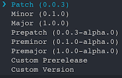

# Tackling the Monolith

Lerna is a really powerful tool for managing monorepo package interdependencies, versioning and publish cycles. It's also really confusing and (relatively) undocumented. Using it is a struggle, even after scowering Medium, YouTube, Reddit, and the Lerna documentation itself! So... I'm here to set the record straight. Let's dive right in.

<!-- START doctoc generated TOC please keep comment here to allow auto update -->
<!-- DON'T EDIT THIS SECTION, INSTEAD RE-RUN doctoc TO UPDATE -->


- [Configuring Yarn Workspaces](#configuring-yarn-workspaces)
- [Configuring Lerna](#configuring-lerna)
- [Shared scripts, linting & compilation](#shared-scripts-linting--compilation)
- [Versioning / Publishing](#versioning--publishing)

<!-- END doctoc generated TOC please keep comment here to allow auto update -->

## Configuring Yarn Workspaces

```sh
mkdir -p example && cd example && yarn init -y
```

Let's also make a directory `packages`:

```sh
mkdir packages
```

Initialize your "sub-repos" (not sure if this is valid terminology) inside of `packages`:

```sh
cd packages
```

Let's make six packages:

```
`-- example
    |-- package.json
    `-- packages
        |-- configs
        |   |-- eslint-config
        |   `-- babel-preset
        |-- utilities
        |-- ui
        |-- client
        `-- server
```

We group our configuration packages inside of the `packages/configs` folder (just for the sake of keeping our tree as clean as possible). Otherwise, let's just add to `packages`:

```sh
mkdir some-package && cd some-package && yarn init -y && cd ..
```

Although, let's initialize `client` via [create-react-app](https://github.com/facebook/create-react-app):

```sh
create-react-app client
```

For each package, prefix your `package.json`'s `name` field with the project name. For instance:

`example/packages/configs/eslint-config/package.json`

```diff
{
- "name": "eslint-config",
+ "name": "@example/eslint-config",
  "version": "1.0.0",
  "main": "index.js",
  "license": "MIT"
}

```

In packages that you'll want to publish to NPM, add the following:

`example/packages/whatever-package/package.json`

```diff
{
  "name": "@example/whatever-package",
  "version": "1.0.0",
  "main": "index.js",
  "license": "MIT",
+ "private": false,
+ "publishConfig": {
+   "access": "public"
+ },
}

```

... or mark `access` private if you've purchased such priveledges from NPM.

Once we've initialized all our packages, let's add them to the `workspaces` field in our root `package.json` (let's also get rid of `version` and `main`):

`example/package.json`

```diff
{
  "name": "example",
- "version": "1.0.0",
- "main": "index.js",
  "license": "MIT",
+ "packages": [
+   "packages/configs/*",
+   "packages/utilities",
+   "packages/ui",
+   "packages/client",
+   "packages/server"
+ ]
}
```

Navigate to your project root and run `yarn`.

Now you'll be able to import packages into oneanother. Unfortunately, these interdependencies won't be visible in each package's `package.json`.

## Configuring Lerna

The current setup isn't very deliberate (not all packages should automatically have access to oneanother). Moreover, this won't work for all deployments. Lerna's gonna help us manage this.

From your root directory:

```sh
yarn add lerna -W
```

We add the `-W` flag to add it to our workspace root... if you try to do this without the `-W` flag it won't work.

Next, we initialize Lerna with the following command:

```sh
node_modules/.bin/lerna init
```

You'll see a newly generated `lerna.json` file at your project root. Let's edit this file a bit:

`example/lerna.json`

```diff
{
  "packages": [
-   "packages/*",
+   "packages/configs/*",
+   "packages/utilities",
+   "packages/ui",
+   "packages/client",
+   "packages/server"
  ],
  "version": "0.0.0"
}
```

There're two options for how we could go about versioning our packages:

1. single versioning: every time you update any package, all other package versions will be automatically updated to that version as well. Aka: a consistent, single version for all packages. This is the default (and simplest).

2. independent versioning: this is something that Lerna does quite well. This is what it looks like:

- package changes will be tracked automatically (aka. you'll never update unchanged packages)
- upon `lerna publish` or `lerna version` (which we'll get into later), you'll be prompted with [SemVer](https://semver.org/) control options (not as intimidating as it sounds at first)
- dependents' `package.json`s will be be updated to reflect the new version of that package on which they depend.

I'd recommend always going the independent route... it's more truthful in the sense that you're never giving a new version to an unchanged package.

To use single versioning, leave the `version` field in `lerna.json` as is. For independent versioning (once again, I recommend this), change the `version` field to "independent".

```diff
{
  "packages": [
    "packages/configs/*",
    "packages/utilities",
    "packages/ui",
    "packages/client",
    "packages/server"
  ],
+ "version": "independent"
}
```

Additionally, let Lerna know to use Workspaces to hoist shared dependencies and to use NPM for publishing (using Yarn for publishing packages is buggy in my experience):

```diff
{
  "packages": [
    "packages/configs/*",
    "packages/utilities",
    "packages/ui",
    "packages/client",
    "packages/server"
  ],
  "version": "independent",
+ "npmCient": "npm",
+ "useWorkspaces": true
}
```

To make things simpler, I'd also recommend installing Lerna globally... that way we don't need to call lerna via its executable (`node_modules/.bin/lerna`):

```sh
yarn add -g Lerna
```

Once we've done this, navigate to your project's root and run the following command:

```sh
lerna bootstrap && lerna link
```

`lerna bootstrap` will install all dependencies. This is similar to `yarn` or `npm install`... the key difference being that it will properly handle adjacent packages (it won't attempt to install them as normal node modules). For whichever adjacent packages are listed as dependencies, `lerna link` creates the actual symlinks. This ensures that any changes will be immediately reflected between linked packages. This might seem confusing given that––from our initial setup of our Yarn Workspace––all packages could import oneanother just fine... but using Lerna for this task allows us greater control; not all packages should have access to oneanother. In this example, here's what we want each package to have access to:

- `packages/utilities`, `packages/ui`, `packages/client` and `packages/server` should access `packages/configs/eslint-config` and `packages/configs/babel-preset`
- `packages/ui`, `packages/client` and `packages/server` should access `packages/utilities`
- `packages/client` should access `packages/ui`

To add @example/package-a to @example/package-b, do the following:

```sh
lerna add @example/package-a --scope=@example/package-b
```

You could also add the `-D` flag to add the package as a dev dependency.

If you click to see the full walkthrough, be ready for some heavy repition... this is definitely something for the Lerna team to simplify.

<details>
<summary>the full `lerna add` example</summary>

```sh
lerna add @example/eslint-config --scope=@example/utilities
```

... and

```sh
lerna add @example/eslint-config --scope=@example/ui
```

... and

```sh
lerna add @example/eslint-config --scope=@example/server
```

... and

```sh
lerna add @example/eslint-config --scope=@example/client
```

... and

```sh
lerna add @example/babel-preset --scope=@example/utilities
```

... and

```sh
lerna add @example/babel-preset --scope=@example/ui
```

... and

```sh
lerna add @example/babel-preset --scope=@example/server
```

... and

```sh
lerna add @example/babel-preset --scope=@example/client
```

... and

```sh
lerna add @example/utilities --scope=@example/ui
```

... and

```sh
lerna add @example/utilities --scope=@example/client
```

... and

```sh
lerna add @example/utilities --scope=@example/server
```

... and

```sh
lerna add @example/ui --scope=@example/client
```

</details>

Once you've added dependencies to the appropriate scopes, run `lerna bootstrap && lerna link` for peace of mind. Every once in a while, it's good to delete all `node_modules` folders and run the "bootstrap" and "link" commands.

If you check the `package.json` of a scope to which you added a sibling package, you should see the dependency listed. You should also see the module as a symlink in the package's `node_modules`.

## Shared scripts, linting & compilation

This step is very specific to your project... so the following might not be too helpful. However, in the case that you're using `create-react-app` to bootstrap your client, I'd recommend using [Rescripts](https://github.com/rescripts/rescripts) to edit your Babel, ESLint, TSLint, StyleLint, Webpack, or other configurations. Once you've configured Rescripts and added the given config package to your client package's scope, using the configuration is pretty simple. To use `@example/eslint-config`, for example:

`.eslintrc.js`

```js
module.exports = {
  extends: [
    'react-app', // to get the built-in CRA linting
    '@example/eslint-config', // to override defaults with our custom config
  ],
}
```

I'm a big fan of keeping close to the wire (aka. compile as little as possible). In newer versions Node, this is very doable, even if you want to use ESModules (check out [esm](https://github.com/standard-things/esm)). But... if you are going to compile, you'll likely want to be able to trigger all of your compilation scripts from the same root script. Here's how you an do that:

First, create the given script for each package.

For a rescripted create-react-app:

```json
"scripts": {
  "start": "rescripts start",
  "build": "rescripts build"
}
```

For simple babel compilation:

```json
"scripts": {
  "start": "babel src --watch --out-dir dist",
  "build": "babel src --out-dir dist"
}
```

Then, to execute the "start" scripts, run the following (from anywhere in your project):

```sh
lerna run --parallel start
```

We keep package-specific scripts inside of their own `package.json`s... then––in the root––we can create a script that triggers multiple packages' scripts simultanously.

## Versioning / Publishing

Use git as you would normally, except for `git push`. `git push` and `npm publish` are triggered with a single with `lerna publish`. The behavior this command is largely determined by the `private` and `publishConfig` fields of individual packages.

Running `lerna version` will take you through the same user input steps a `lerna publish`, but will keep changes local.

We're not going to use `lerna version` through... we're gonna trigger `lerna publish`.

Upon doing this, lerna will ask you to select a new version for each changed package. Don't worry if it asks you to version packages whose `private` field is set to false. Lerna knows not to publish these packages.

For each package, you'll see a set of options like this:



After this process, you should see that the most recent commit has been pushed to your repository (and that any public packages have been published to NPM).
